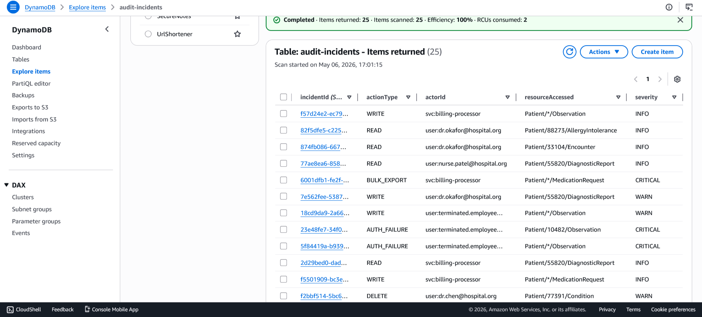
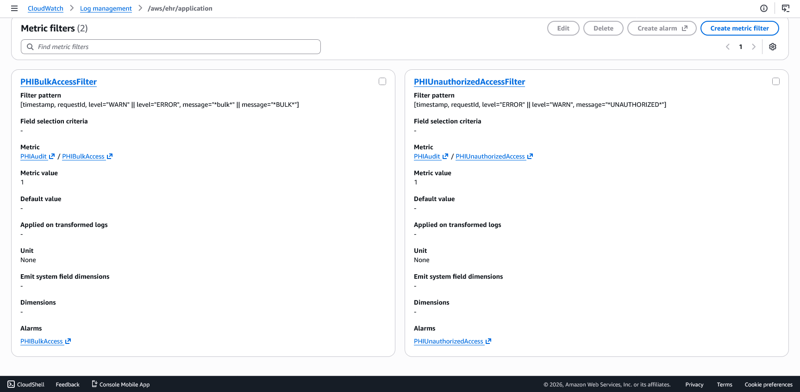
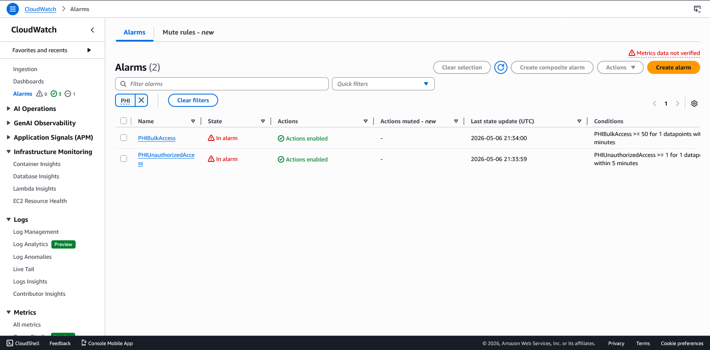
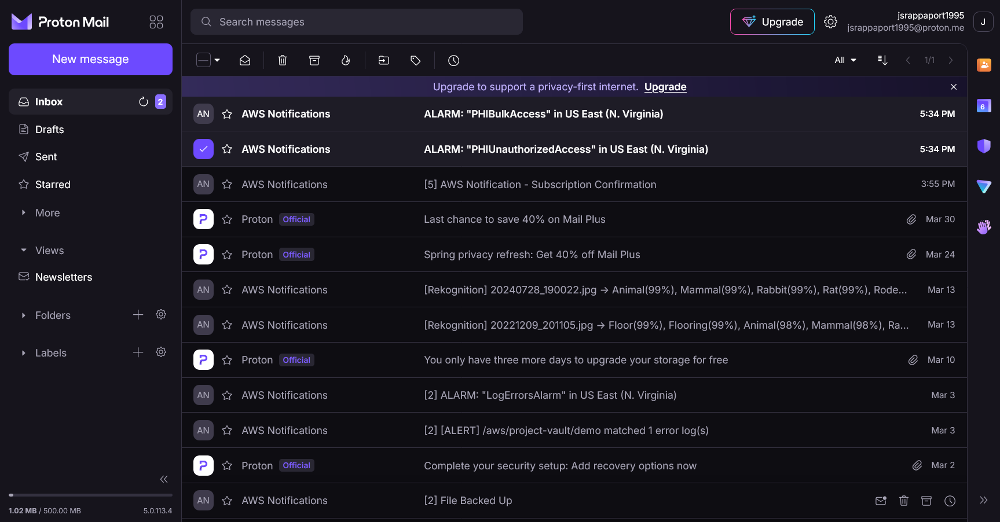
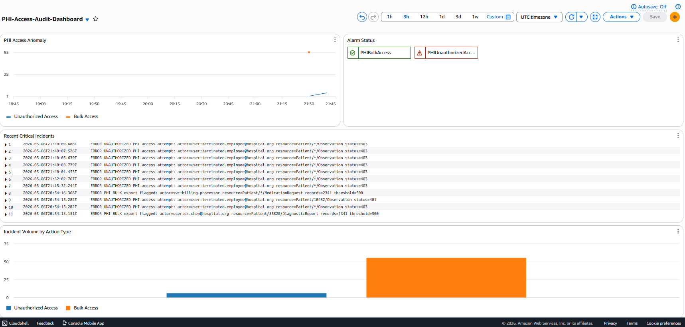

# HIPAA PHI Access Audit Logging System

Monitors application logs for electronic Protected Health Information (ePHI) access
events in near-real time, triggers compliance alerts, and maintains a durable audit
trail — satisfying the HIPAA Security Rule Audit Controls standard at 45 CFR §164.312(b).

**Services:** Amazon CloudWatch · AWS Lambda · Amazon DynamoDB · Amazon SNS · (Optional) Amazon S3 · Amazon Athena · Amazon QuickSight

---

## Architecture

```
App / EHR Service → CloudWatch Logs (Log Group)
  → (A) Metric Filter → CloudWatch Alarm → SNS (email notification)
  → (B) Subscription Filter → Lambda (LogAlertProcessor) → DynamoDB (audit incidents)
  → CloudWatch Dashboard (metrics + log insights + alarm widget)
```

Two independent response pipelines fire from a single CloudWatch Log Group:

- **Pipeline A — Real-Time Alerting:** A CloudWatch Metric Filter detects PHI access
  anomalies (unauthorized access attempts, bulk record queries, off-hours access). When
  the metric breaches threshold, a CloudWatch Alarm fires and SNS delivers an email
  notification within seconds.

- **Pipeline B — Durable Audit Trail:** A CloudWatch Logs Subscription Filter streams
  every matching log event to `LogAlertProcessor` (Lambda), which writes a structured
  incident record to DynamoDB. Each record captures actor, resource accessed, action
  type, and timestamp — forming the queryable, long-retention audit log required under
  HIPAA.

---

## HIPAA Compliance Design

This system is designed against the HIPAA Security Rule Technical Safeguards
(45 CFR §164.312), making it suitable as a foundation for audit logging in systems
that handle ePHI.

### Audit Controls (§164.312(b))

The regulation requires "hardware, software, and procedural mechanisms that record and
examine activity in information systems that contain or use ePHI." This pipeline
implements that requirement end-to-end:

| Component | Compliance Function |
|---|---|
| CloudWatch Metric Filter | Automated detection of PHI access anomalies in application logs |
| CloudWatch Alarm + SNS | Real-time notification of threshold-breaching or suspicious access events |
| Lambda (LogAlertProcessor) | Structured incident parsing — extracts actor, resource, action, timestamp |
| DynamoDB (audit incidents table) | Durable, queryable audit record store supporting long-term retention |
| CloudWatch Dashboard | Ongoing access trend review per §164.308(a)(1)(ii)(D) |

### Access Controls (§164.312(a))

Least-privilege IAM roles are scoped to specific resource ARNs at every service
boundary. No policy in this pipeline uses `*` for actions or resources.

| Role | Permissions Granted |
|---|---|
| Lambda execution role | `dynamodb:PutItem` on the specific incidents table ARN only |
| CloudWatch Logs resource-based permission | `lambda:InvokeFunction` on `LogAlertProcessor` ARN — granted via `aws_lambda_permission`, scoped to `logs.amazonaws.com` with the Log Group ARN as source |
| SNS publish role | `sns:Publish` on the specific alert topic ARN only |

### Data Integrity (§164.312(c))

- DynamoDB incident records are written once on creation; the audit trail is append-only
- Each record includes both `eventTime` (when the access occurred) and `ingestTime`
  (when the pipeline processed it), enabling correct handling of delayed or out-of-order
  log delivery
- Failed Lambda invocations route to an SQS dead-letter queue (`log-alert-processor-dlq`)
  rather than silently dropping audit events — supporting completeness verification and
  breach investigation. On parse failure, Lambda writes a degraded record with
  `actionType=UNKNOWN` and `severity=WARN` rather than throwing, preserving the event
  in the audit trail

### Transmission Security (§164.312(e))

- All data transmitted over TLS between CloudWatch Logs, Lambda, DynamoDB, and SNS
- No ePHI is transmitted or stored in plaintext at any stage of the pipeline
- (Optional) S3 bucket enforces SSE-AES256 encryption at rest for long-term log archival

---

## DynamoDB Incident Record Schema

Each PHI access event persists as a structured record:

| Field | Description |
|---|---|
| `incidentId` | UUID primary key |
| `actorId` | User or service that performed the access |
| `resourceAccessed` | Patient record ID or resource path |
| `actionType` | `READ`, `WRITE`, `DELETE`, `BULK_EXPORT`, `AUTH_FAILURE` |
| `eventTime` | Timestamp from the original log event |
| `ingestTime` | Timestamp when the pipeline processed the event |
| `severity` | `INFO`, `WARN`, `CRITICAL` |
| `logGroup` | Source CloudWatch Log Group |
| `rawMessage` | Original log line (truncated at 1 KB) |



---

## CloudWatch Metric Filter

Two metric filters are deployed on the log group, each targeting a distinct access
anomaly class:

**Filter 1 — Unauthorized Access (`PHIUnauthorizedAccessFilter`)**
```
UNAUTHORIZED
```
Feeds the `PHIAudit/PHIUnauthorizedAccess` metric. Any match triggers the
`PHIUnauthorizedAccess` alarm immediately.

**Filter 2 — Bulk Access (`PHIBulkAccessFilter`)**
```
?bulk ?BULK
```
Feeds the `PHIAudit/PHIBulkAccess` metric. Triggers the `PHIBulkAccess` alarm when
volume exceeds 50 events in a 10-minute window.



---

## CloudWatch Alarm + SNS Alerting

Alarms are configured on two metrics:

- **PHIUnauthorizedAccess** — threshold: ≥ 1 event in 5 minutes → `CRITICAL` alert
- **PHIBulkAccess** — threshold: ≥ 50 read events per actor in 10 minutes → `WARN` alert

When an alarm enters `ALARM` state, SNS delivers an email notification immediately.





---

## CloudWatch Dashboard

The unified dashboard consolidates:

- **PHI Access Anomaly** metric graph (15-minute rolling window, period: 900s)
- **Alarm status widget** — live ALARM / OK state for all configured thresholds
- **CloudWatch Logs Insights query** — most recent 20 UNAUTHORIZED and BULK access events from raw log data
- **Incident volume by action type** — breakdown of READ / WRITE / AUTH_FAILURE over time



---

## (Optional) S3 / Athena / QuickSight

For longer-retention analytics and periodic access reviews (satisfying
§164.308(a)(1)(ii)(D) — Information System Activity Review), log data can be shipped
to S3 and queried with Athena or visualized in QuickSight. This converts the real-time
pipeline into a full audit analytics platform, enabling:

- Per-user PHI access frequency reports
- After-hours access trend analysis
- Export of audit records for compliance reviews or breach investigations

---


## How to Run

1. Create an S3 bucket and DynamoDB table for Terraform remote state (done manually once)
2. Fill in the backend block in `main.tf` with your bucket name and lock table name
3. Configure AWS credentials in your shell:
   ```bash
   aws sso login
   eval $(aws configure export-credentials --format env)
   ```
4. Deploy all infrastructure:
   ```bash
   terraform init
   terraform apply
   ```
5. Confirm the SNS email subscription — check your inbox for the AWS confirmation email and click the link
6. Publish test log events to verify both pipelines fire:
   ```bash
   python seed_incidents.py
   ```
7. Check DynamoDB `audit-incidents` table after ~30 seconds to confirm Lambda wrote incident records

---

## Cleanup

To tear down all AWS resources and avoid ongoing charges:

```bash
terraform destroy
```

Note: `terraform destroy` will attempt to delete the SNS topic and its email subscription. If the subscription is still pending confirmation, delete it manually in the console first, then run `terraform destroy`.
